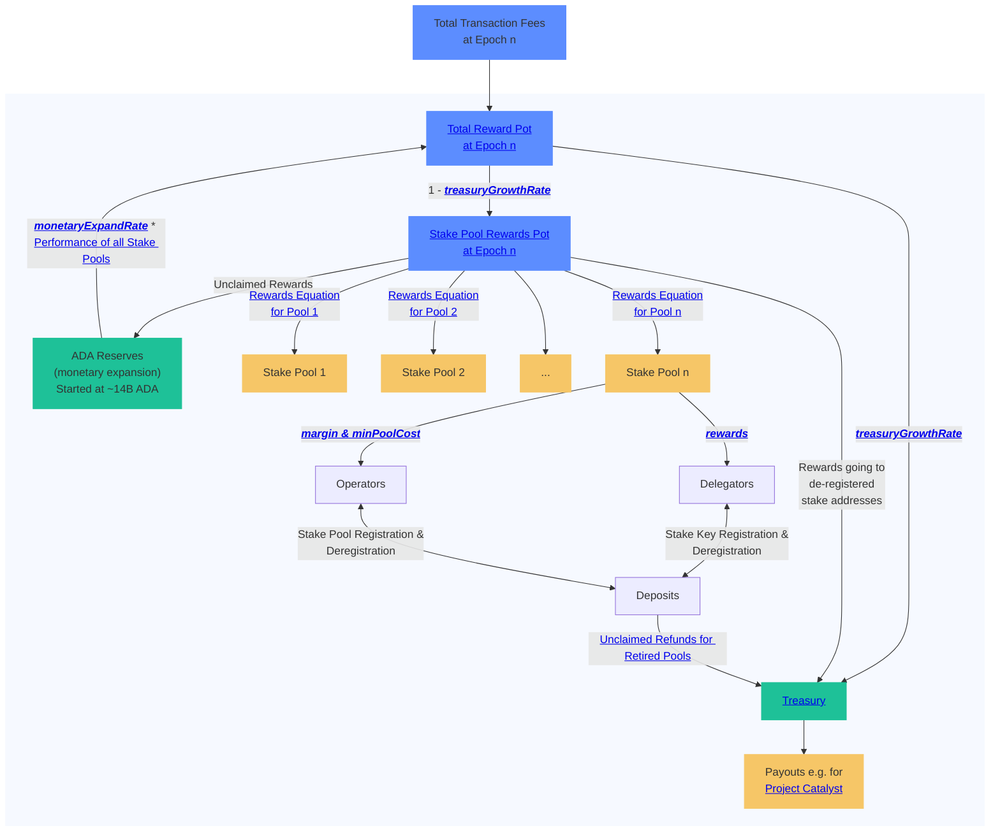

# Cardano Rewards Calculation 🚧️ Under Construction 🚧️

<p align="left">


<a href="https://conventionalcommits.org"></a>
<a href="https://opensource.org/licenses/MIT"></a>
</p>

This java project is used to calculate the rewards of the Cardano network. It aims to be both an edge case documentation and formula implementation.

## 🧪 Test Reports

To ensure the stability and reliability of this project, unit tests have been implemented. By clicking on the link below, you can access the detailed test report.
We also generate for each version of this project calculation reports. These reports are generated by the unit tests and contain the calculation results compared to the actual values.

📈 [Treasury Calculation Report](https://cardano-foundation.github.io/cf-java-rewards-calculation/report-latest/treasury_calculation.html)
📊 [Coverage Report](https://cardano-foundation.github.io/cf-java-rewards-calculation/coverage-report/)



## 🚀 Getting Started

#### Prerequisites

Java 17

#### Build & Test

```
git clone https://github.com/cardano-foundation/cf-java-rewards-calculation.git
cd cf-java-rewards-calculation
./mvnw clean test
```
#### Data Provider
The pool rewards calculation and also the treasury calculation requires a data provider to perform the calculation.
This repository offers different data providers and also an interface if you want to add your own provider. The following data providers are available:

 - [Koios Data Provider](./src/main/java/org/cardanofoundation/rewards/validation/data/provider/KoiosDataProvider.java)
 - [JSON Data Provider](./src/main/java/org/cardanofoundation/rewards/validation/data/provider/JsonDataProvider.java)
 - [DbSync Data Provider](./src/main/java/org/cardanofoundation/rewards/validation/data/provider/DbSyncDataProvider.java)
 - Yaci Store Data Provider (Coming Next 👀)

#### Data Fetcher

The data fetcher is used to fetch the data from the data provider and put it into local json files.
These files can be used to perform the calculation using the JSON Data Provider. The following data fetchers are available:

 - [Koios Data Fetcher](./src/main/java/org/cardanofoundation/rewards/validation/data/fetcher/KoiosDataFetcher.java)
 - [DbSync Data Fetcher](./src/main/java/org/cardanofoundation/rewards/validation/data/fetcher/DbSyncDataFetcher.java)

To make the application fetching the data, create an .env file with the following content in the `src/main/resources` folder:

```
SPRING_PROFILES_ACTIVE=db-sync

RUN_MODE=fetch
OVERWRITE_EXISTING_DATA=false

POSTGRES_USER=<username>
POSTGRES_PASSWORD=<password>
POSTGRES_DB=cexplorer

JSON_DATA_SOURCE_FOLDER=/path/to/your/rewards-calculation-test-data
```
  
## 🫡 Roadmap
 - [ ] Add a data provider for [Yaci Store](https://github.com/bloxbean/yaci-store) (scoped indexer 👀)
 - [ ] Create REST endpoints to get the rewards as a service
 - [X] Include MIR certificates
 - [ ] Add a `/docs` folder containing parsable Markdown files to explain MIR certificates and edge cases
 - [ ] Enhance reporting and add values for the other pots as well. Include information from the `/docs` folder
 - [X] Calculate member and operator rewards
 - [X] Add deposits and utxo pot
 - [X] Calculate unclaimed rewards that need to go back to the reserves
 - [X] Put rewards to unregistered stake addresses into the treasury
 - [ ] A nice web ui to visualize the rewards calculation

## 📖 Sources
 - [Shelley Cardano Delegation Specification](https://github.com/input-output-hk/cardano-ledger/releases/download/cardano-ledger-spec-2023-04-03/shelley-ledger.pdf)
 - [Shelley Cardano Ledger Specification](https://github.com/input-output-hk/cardano-ledger/releases/download/cardano-ledger-spec-2023-04-03/shelley-ledger.pdf)
 - [Protocol Parameters - CIP-0009](https://cips.cardano.org/cips/cip9/)
 - Beavr Cardano Stake Pool: [How is the Rewards Pot (R) Calculated](https://archive.ph/HQfoV/fb8166e31d2bf61d3d6ca769e7785f2a96530f8e.webp)
 - [History of Protocol Parameters](https://beta.explorer.cardano.org/en/protocol-parameters/)
