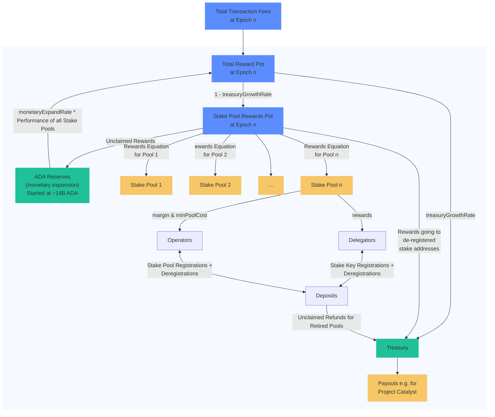

# Cardano Rewards Calculation 🧮

<p align="left">
<a href="https://cardano-foundation.github.io/cf-java-rewards-calculation/coverage-report/"></a>
<a href="https://cardano-foundation.github.io/cf-java-rewards-calculation/coverage-report/"></a>

<a href="https://central.sonatype.com/artifact/org.cardanofoundation/cf-rewards-calculation"></a>
<a href="https://cardano-foundation.github.io/cf-java-rewards-calculation/report-latest/treasury_calculation.html"></a>
<a href="https://conventionalcommits.org"></a>
<a href="https://opensource.org/licenses/MIT"></a>
<a href="https://discord.gg/4WVNHgQ7bP"></a>
</p>

This project is aims to target *multiple goals*. First of all, it tries to *re-implement the cardano ledger rules* for calculating 
the [ADA pots](https://cexplorer.io/pot) (Treasury, Reserves, Rewards, Deposits, Utxo, Fees), as well as the rewards for stake pool operators and delegators. 
The second goal is to use this implementation to *[validate the rewards calculation](https://cardano-foundation.github.io/cf-java-rewards-calculation/report-latest/treasury_calculation.html)* of the Cardano blockchain by providing a *different implementation of the [ledger specification](https://github.com/IntersectMBO/cardano-ledger?tab=readme-ov-file#cardano-ledger)*.
The third goal is to *provide a library* that can be used in other project (such as [yaci-store](https://github.com/bloxbean/yaci-store)) to serve the rewards data *independently of [DB Sync](https://github.com/IntersectMBO/cardano-db-sync)*. 
Last but not least, this project could also be used to *understand the influence of protocol parameters* and the flow of ADA through an interactive report.

## 🧪 Test Reports

To ensure the stability and reliability of this project, unit tests have been implemented. By clicking on the link below, you can access the detailed test report.
We also generate for each version of this project calculation reports. These reports are generated by the unit tests and contain the calculation results compared to the actual values.

📈 [Treasury Calculation Report](https://cardano-foundation.github.io/cf-java-rewards-calculation/report-latest/treasury_calculation.html)
📊 [Coverage Report](https://cardano-foundation.github.io/cf-java-rewards-calculation/coverage-report/)



## 🤓 Interesting Findings

While the flowchart above shows the calculation of the Ada pots in general, there are some more aspects that need to be considered:

- The point in time 🕑. The reward calculation starts at slot `(4 * 2160) / 0.05) = 172800` (48h) each epoch. Before the Babbage era, 
  accounts that were de-registered **before** this point in time were not considered for the rewards calculation.  
  This means that the rewards for the de-registered stake addresses are not considered in the rewards calculation. 
  Those rewards were not distributed and went therefore back to the **reserves**. Accounts that deregistered **after** 
  this point in time, but before the end of the epoch, were considered for the rewards calculation. But as it is not 
  possible to send rewards to a de-registered stake address, the rewards went back to the **treasury**.
- At the Allegra hard fork, the (pre-Shelley) bootstrap addresses were removed from the UTxO and the Ada contained in them was returned to the reserves.
- There was a different behavior (pre-Allegra): If a pool reward address had been used for multiple pools,
  the stake account only received the reward for one of those pools and did also not get any member rewards.
  This **behavior has changed in mainnet epoch 236** with the Allegra hard fork. Now, the stake account receives the rewards for all pools (including member rewards).
- Transaction fees and a part of the reserve is used to build the total reward pot. It is often mentioned that
  the monetary expansion rate (protocol parameter) is used to calculate the part coming from the reserves.
  While this is true, the actual calculation is a multiplication of the monetary expansion rate and the performance of all stake pools `eta`.
  `Eta` is the ratio of the blocks produced **by pools** in an epoch and the expected blocks `(432000 slots per epoch / 20 sec per block = 21600)`.
  With beginning of Shelly the blocks were produced by OBFT nodes and not by pools. Therefore, the performance of all stake pools would be 0.
  The decentralization parameter `d` has been introduced to slightly increase the amount of **expected blocks produced by pools**.
  In the time when `d` was above 0.8 `eta` was set to 1.0. `d` decreased over time from 1.0 to 0.0 and disappeared completely with the Vasil hard fork.
- The pool deposit is currently 500 Ada. This deposit will be returned (on the next epoch boundary) to the pool reward address when the pool is retired.
  However, if the deposit could not be returned (e.g. because the pool reward address is de-registered), the **deposit will be added to the treasury** instead.
- Pool updates override pool deregistrations. This means that if a pool is updated before the end of the epoch, the pool will not be retired and the deposit will not be returned.

## 🚀 Getting Started

You can use this project as a library in your own project. The library is available through maven central,
or you can clone the repository and run the tests or build the library yourself.

#### Maven

```xml
<dependency>
    <groupId>org.cardanofoundation</groupId>
    <artifactId>cf-rewards-calculation</artifactId>
    <version>0.9.0</version>
</dependency>
```

Make sure to have Java 17 installed and run the following commands:

```
git clone https://github.com/cardano-foundation/cf-java-rewards-calculation.git
cd cf-java-rewards-calculation
./mvnw clean test
```

## 📦 Usage

In the near future you can use the calculation part of this repository as a library in your own project as it will be accessible 
through maven central.

For now the structure of the repository is divided in two parts:
 
- calculation package
  - [EpochCalculation](calculation/src/main/java/org/cardanofoundation/rewards/calculation/EpochCalculation.java)
  - [DepositsCalculation](calculation/src/main/java/org/cardanofoundation/rewards/calculation/DepositsCalculation.java)
  - [PoolRewardsCalculation](calculation/src/main/java/org/cardanofoundation/rewards/calculation/PoolRewardsCalculation.java)
  - [TreasuryCalculation](calculation/src/main/java/org/cardanofoundation/rewards/calculation/TreasuryCalculation.java)

- validation package
  - [EpochValidation](validation/src/main/java/org/cardanofoundation/rewards/validation/EpochValidation.java)
  - [DepositsValidation](validation/src/main/java/org/cardanofoundation/rewards/validation/DepositsValidation.java)
  - [PoolRewardValidation](validation/src/main/java/org/cardanofoundation/rewards/validation/PoolRewardValidation.java)
  - [TreasuryValidation](validation/src/main/java/org/cardanofoundation/rewards/validation/TreasuryValidation.java)
  - ...

While the calculation package is used as a pure re-implementation of the ledger specification,
the validation package is used to get the needed data (e.g. registration/deregistration certificates, epoch stakes, etc.) 
from the data provider and execute the calculation. Furthermore, the validation package is used to compare the calculated
values with the actual values using DB Sync as ground truth.

#### Data Provider

The pool rewards calculation and also the treasury calculation requires a data provider to perform the calculation.
This repository offers different data providers and also an interface if you want to add your own provider. The following data providers are available:

 - [Koios Data Provider](validation/src/main/java/org/cardanofoundation/rewards/validation/data/provider/KoiosDataProvider.java)
 - [JSON Data Provider](validation/src/main/java/org/cardanofoundation/rewards/validation/data/provider/JsonDataProvider.java)
 - [DbSync Data Provider](validation/src/main/java/org/cardanofoundation/rewards/validation/data/provider/DbSyncDataProvider.java)

#### Data Fetcher

The data fetcher is used to fetch the data from the data provider and put it into local json files.
These files can be used to perform the calculation using the JSON Data Provider. The following data fetchers are available:

 - [Koios Data Fetcher](validation/src/main/java/org/cardanofoundation/rewards/validation/data/fetcher/KoiosDataFetcher.java)
 - [DbSync Data Fetcher](validation/src/main/java/org/cardanofoundation/rewards/validation/data/fetcher/DbSyncDataFetcher.java)

To make the application fetching the data, create an `.env` file with the following content in the [validation resources folder](validation/src/main/resources/.env):

```
SPRING_PROFILES_ACTIVE=db-sync

RUN_MODE=fetch
OVERWRITE_EXISTING_DATA=false
DATA_FETCHER_START_EPOCH=<start-epoch>
DATA_FETCHER_END_EPOCH=<end-epoch>
DATA_FETCHER_SKIP_VALIDATION_DATA=<true|false>

POSTGRES_USER=<username>
POSTGRES_PASSWORD=<password>
POSTGRES_DB=cexplorer

JSON_DATA_SOURCE_FOLDER=/path/to/your/rewards-calculation-test-data
```
> [!NOTE]
>️ The actual rewards data will also be fetched when setting DATA_FETCHER_SKIP_VALIDATION_DATA=false, but it is only used from the validator and not within the calculation itself.`
  
#### Data Plotter

The data plotter is used to generate the report. The following data plotters are available:

 - [Koios Data Plotter](./validation/src/main/java/org/cardanofoundation/rewards/validation/data/plotter/JsonDataPlotter.java)

To use the application to make the report, create an `.env` file with the following content in the [validation resources folder](validation/src/main/resources/.env):

```
SPRING_PROFILES_ACTIVE=json
RUN_MODE=plot
JSON_DATA_SOURCE_FOLDER=/path/to/your/rewards-calculation-test-data
```

## 🫡 Roadmap
 - [ ] Enhance reporting and add values for the other pots as well. Display the flow of Ada within an epoch
 - [ ] Add a `/docs` folder containing parsable Markdown files to explain MIR certificates and edge cases
 - [X] Provide a library through maven central to use the calculation in other projects
 - [X] Find out the root cause of the difference between the actual rewards and the calculated rewards beginning with epoch 350
 - [X] Include MIR certificates
 - [X] Calculate member and operator rewards
 - [X] Add deposits and utxo pot
 - [X] Calculate unclaimed rewards that need to go back to the reserves
 - [X] Put rewards to unregistered stake addresses into the treasury

## 📖 Sources
 - [Shelley Cardano Delegation Specification](https://github.com/input-output-hk/cardano-ledger/releases/download/cardano-ledger-spec-2023-04-03/shelley-ledger.pdf)
 - [Shelley Cardano Ledger Specification](https://github.com/input-output-hk/cardano-ledger/releases/download/cardano-ledger-spec-2023-04-03/shelley-ledger.pdf)
 - [Protocol Parameters - CIP-0009](https://cips.cardano.org/cips/cip9/#updatableprotocolparameters)
 - Beavr Cardano Stake Pool: [How is the Rewards Pot (R) Calculated](https://archive.ph/HQfoV/fb8166e31d2bf61d3d6ca769e7785f2a96530f8e.webp)
 - [History of Protocol Parameters](https://beta.explorer.cardano.org/en/protocol-parameters/)
