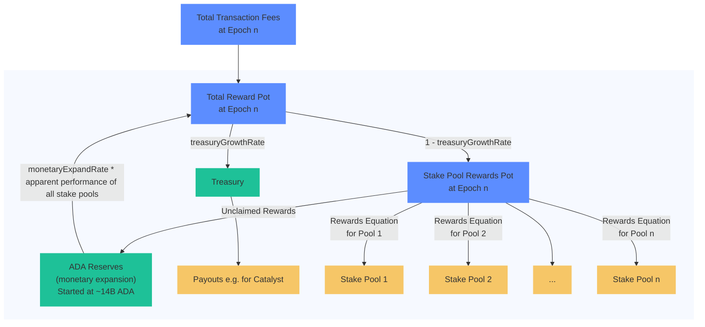

# Cardano Rewards Calculation 🚧️ Under Construction 🚧️

<p align="left">


<a href="https://conventionalcommits.org"></a>
<a href="https://opensource.org/licenses/MIT"></a>
</p>

This java project is used to calculate the rewards of the Cardano network. It aims to be both an edge case documentation and formula implementation.



## 🚀 Getting Started

#### Prerequisites

Java 17

#### Build & Test

```
git clone https://github.com/cardano-foundation/cf-java-rewards-calculation.git
cd cf-java-rewards-calculation
./mvnw clean test
```

## 🧪 Test Reports

To ensure the stability and reliability of this project, unit tests have been implemented. By clicking on the link below, you can access the detailed test report.

📊 [Coverage Report](https://cardano-foundation.github.io/cf-java-rewards-calculation/coverage-report/)

## 📖 Sources

 - Beavr Cardano Stake Pool: [How is the Rewards Pot (R) Calculated](https://archive.ph/HQfoV/fb8166e31d2bf61d3d6ca769e7785f2a96530f8e.webp)
 - Protocol Parameters: https://beta.explorer.cardano.org/en/protocol-parameters/
